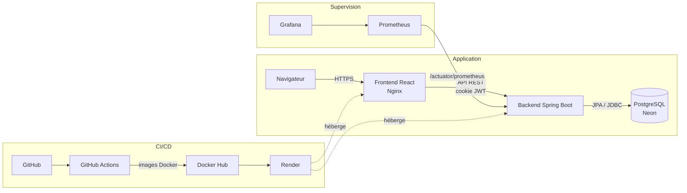
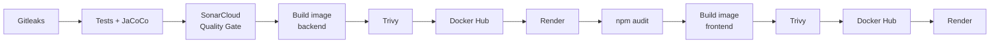

# PharmaHOSS

Application web de gestion de pharmacie, livrée et exploitée au travers d'une chaîne DevSecOps complète : intégration continue, analyse de qualité et de sécurité, conteneurisation, déploiement continu et supervision.

[](https://github.com/OUMA-ch/pharmacy-devsecops/actions/workflows/ci-cd.yml)
[](https://sonarcloud.io/summary/new_code?id=OUMA-ch_pharmacy-devsecops)

---

## Sommaire

1. [Présentation](#présentation)
2. [Fonctionnalités par rôle](#fonctionnalités-par-rôle)
3. [Architecture](#architecture)
4. [Stack technique](#stack-technique)
5. [Chaîne DevSecOps](#chaîne-devsecops)
6. [Sécurité applicative](#sécurité-applicative)
7. [Supervision](#supervision)
8. [Lancer le projet en local](#lancer-le-projet-en-local)
9. [Tests](#tests)
10. [Structure du dépôt](#structure-du-dépôt)
11. [Auteur et encadrement](#auteur-et-encadrement)

---

## Présentation

PharmaHOSS est un Projet de Fin d'Année (PFA) du Master RSI de la FST Settat.

Le projet a deux volets :

- **Une application web de gestion de pharmacie** : un backend REST Spring Boot et un frontend React, qui couvrent la gestion des produits, des ventes, des ordonnances, des commandes, des fournisseurs et des pharmaciens, avec des espaces distincts selon le rôle de l'utilisateur.
- **Une chaîne DevSecOps** qui automatise le cycle de vie de l'application, du commit jusqu'à la production : détection de secrets, tests et couverture, analyse de qualité avec Quality Gate bloquant, scan de vulnérabilités des images Docker et des dépendances, publication sur Docker Hub, déploiement sur Render et supervision avec Prometheus et Grafana.

---

## Fonctionnalités par rôle

L'application définit trois rôles. Chaque utilisateur est redirigé vers l'espace correspondant à son rôle après connexion.

### CLIENT

- Création d'un compte depuis la page d'inscription.
- Consultation de ses notifications (par exemple la confirmation d'un achat enregistré par la pharmacie).
- Recherche par mot-clé dans ses notifications.

### PHARMACIEN

- Tableau de bord d'accueil.
- **Produits** : ajout, modification, suppression et consultation (stock, prix, date de péremption).
- **Ventes** : enregistrement d'une vente pour un client, avec ordonnance associée si nécessaire (nom du médecin, date d'émission, description) ; modification et suppression. Le client reçoit une notification de confirmation.
- **Commandes** : création de commandes auprès des fournisseurs, suivi et changement de statut (`EN_ATTENTE`, `LIVREE`, `ANNULEE`).
- **Fournisseurs** : gestion des fournisseurs et des produits qu'ils fournissent, avec leur prix d'achat.

### RESPONSABLE

- Toutes les fonctionnalités du pharmacien.
- **Gestion des pharmaciens** : création, modification et suppression des comptes pharmaciens.
- **Rapports** : graphiques en barres (ventes par produit en quantité ou en chiffre d'affaires sur une période, stock par produit, produits en stock faible).

---

## Architecture



- Le **frontend** est une application React compilée par Vite et servie en fichiers statiques par Nginx.
- Le **backend** expose une API REST sécurisée par Spring Security et persiste les données dans **PostgreSQL** (hébergé sur Neon en production).
- **GitHub Actions** construit, teste et analyse le code, publie les images sur **Docker Hub**, puis déclenche le déploiement sur **Render**.
- **Prometheus** collecte les métriques exposées par le backend ; **Grafana** les visualise.

---

## Stack technique

| Domaine | Technologies |
|---|---|
| Backend | Java 17, Spring Boot 4, Spring Web MVC, Spring Data JPA, Spring Security, Bean Validation, JJWT, Lombok |
| Frontend | React 18, TypeScript, Vite, React Router, TanStack Query, React Hook Form, Zod, Tailwind CSS, Recharts |
| Base de données | PostgreSQL (Neon en production, PostgreSQL 16 en CI) |
| Tests | JUnit, Spring Boot Test, JaCoCo (backend) ; Vitest, Testing Library (frontend) |
| Qualité de code | SonarCloud, ESLint, Prettier |
| Sécurité de la chaîne | Gitleaks, Trivy, npm audit |
| Conteneurisation | Docker (builds multi-étapes), Docker Compose, Nginx |
| CI/CD | GitHub Actions |
| Registre d'images | Docker Hub |
| Hébergement | Render |
| Supervision | Spring Boot Actuator, Micrometer, Prometheus, Grafana |

---

## Chaîne DevSecOps

Le pipeline est défini dans [`.github/workflows/ci-cd.yml`](.github/workflows/ci-cd.yml). Il s'exécute à chaque `push` et à chaque `pull request` sur les branches `develop` et `master`. Les étapes de publication et de déploiement ne s'exécutent que sur `master`.



Étapes, dans l'ordre du workflow :

| # | Étape | Rôle |
|---|---|---|
| 1 | **Récupération du code** | Checkout de l'historique complet (nécessaire à Gitleaks et SonarCloud). |
| 2 | **Gitleaks** | Recherche de secrets (clés, tokens, mots de passe) dans le code et l'historique Git. |
| 3 | **Tests + couverture JaCoCo** | `mvn clean verify` : compilation, tests unitaires et d'intégration du backend sur une base PostgreSQL 16 lancée comme service du job, génération du rapport JaCoCo et vérification d'un seuil minimal de couverture. |
| 4 | **Analyse SonarCloud** | Analyse statique (bugs, vulnérabilités, code smells, couverture). L'option `sonar.qualitygate.wait=true` rend le **Quality Gate bloquant** : le pipeline échoue si la Quality Gate n'est pas validée. |
| 5 | **Publication du rapport JaCoCo** | Rapport de couverture archivé comme artefact du build. |
| 6 | **Build de l'image Docker backend** | Build multi-étapes : compilation Maven, puis image d'exécution JRE allégée. |
| 7 | **Scan Trivy backend (bloquant)** | Le pipeline échoue en présence de vulnérabilités de sévérité `CRITICAL` ou `HIGH`. |
| 8 | **Scan Trivy backend (rapport complet)** | Rapport informatif toutes sévérités, archivé comme artefact. |
| 9 | **Publication sur Docker Hub** | Image backend taguée avec le SHA du commit et `latest` *(master uniquement)*. |
| 10 | **Déploiement Render backend** | Déclenchement du redéploiement via un deploy hook stocké en secret GitHub *(master uniquement)*. |
| 11 | **Installation du frontend** | Node.js 20, `npm ci` à partir du `package-lock.json`. |
| 12 | **npm audit** | Audit des dépendances de production du frontend ; échec à partir du niveau `high`. |
| 13 | **Build de l'image Docker frontend** | Build Vite, puis image Nginx servant le bundle statique. |
| 14 | **Scan Trivy frontend (bloquant + rapport complet)** | Mêmes règles que pour le backend. |
| 15 | **Publication sur Docker Hub** | Image frontend taguée avec le SHA du commit et `latest` *(master uniquement)*. |
| 16 | **Déploiement Render frontend** | Déclenchement du redéploiement du frontend *(master uniquement)*. |

Toutes les informations sensibles utilisées par le pipeline (tokens SonarCloud et Docker Hub, deploy hooks Render) sont stockées dans les **secrets GitHub Actions** et jamais dans le dépôt.

---

## Sécurité applicative

- **Authentification par JWT en cookie** : après connexion, le jeton est transmis dans un cookie `HttpOnly` (inaccessible au JavaScript) et `Secure` (HTTPS uniquement), avec un attribut `SameSite` configurable et une durée de validité limitée. L'API est sans état (pas de session serveur).
- **Contrôle d'accès par rôle (RBAC)** : les autorisations sont appliquées côté serveur par Spring Security pour chaque route (`CLIENT`, `PHARMACIEN`, `RESPONSABLE`). Le frontend masque en complément les écrans non autorisés.
- **Contrôle d'accès aux ressources** : un client ne peut consulter que ses propres données (par exemple ses notifications), vérifié au niveau des méthodes avec `@PreAuthorize`.
- **Validation des entrées** : contraintes Bean Validation côté backend et schémas Zod côté frontend, avec des erreurs renvoyées de façon uniforme par un gestionnaire d'exceptions global.
- **Politique de mot de passe** : 8 à 72 caractères, avec au moins une majuscule, une minuscule et un chiffre, appliquée à la création et à la modification des comptes. Les mots de passe sont hachés avec **BCrypt**.
- **Limitation des tentatives de connexion** : au-delà de 5 échecs en 60 secondes pour un même email ou une même adresse IP, les tentatives suivantes sont refusées (HTTP 429).
- **CORS restreint** : seules les origines explicitement configurées peuvent appeler l'API avec des cookies.
- **Endpoints techniques protégés** : seuls `/actuator/health` et `/actuator/prometheus` sont publics ; les autres endpoints Actuator sont réservés au rôle `RESPONSABLE`.
- **Secrets hors du code** : connexion à la base, secret JWT et origines CORS sont fournis par variables d'environnement. Le secret JWT n'a aucune valeur par défaut : l'application refuse de démarrer s'il n'est pas défini.

---

## Supervision

Le backend expose ses métriques au format Prometheus grâce à **Spring Boot Actuator** et **Micrometer** sur `/actuator/prometheus`.

- **Prometheus** ([`monitoring/prometheus.yml`](monitoring/prometheus.yml)) interroge cet endpoint toutes les 30 secondes.
- **Grafana** utilise Prometheus comme source de données pour construire les tableaux de bord.

Métriques disponibles, notamment :

- **Requêtes HTTP** : nombre de requêtes, temps de réponse, codes de statut, par route ;
- **JVM** : mémoire (heap / non-heap), ramasse-miettes, threads, classes chargées ;
- **Processus et système** : utilisation CPU, temps de fonctionnement (uptime) ;
- **Pool de connexions à la base** (HikariCP) : connexions actives, en attente, disponibles.

L'endpoint `/actuator/health` sert par ailleurs de sonde de disponibilité pour Render.

---

## Lancer le projet en local

### Prérequis

- **Docker** et **Docker Compose** (lancement complet), ou :
- **Java 17** et **Maven** (le wrapper `mvnw` est fourni) pour le backend ;
- **Node.js 20** et **npm** pour le frontend ;
- une base **PostgreSQL** accessible.

### Variables d'environnement

Les valeurs ci-dessous sont des **exemples fictifs** à remplacer par vos propres valeurs. Ne jamais les committer.

**Backend**

| Variable | Description | Exemple |
|---|---|---|
| `DB_HOST` | Hôte PostgreSQL | `localhost` |
| `DB_PORT` | Port PostgreSQL | `5432` |
| `DB_NAME` | Nom de la base | `gestion_pharmacie` |
| `DB_USER` | Utilisateur de la base | `pharmacie_user` |
| `DB_PASSWORD` | Mot de passe de la base | `changez-moi` |
| `DB_SSLMODE` | Mode SSL de la connexion | `disable` en local, `require` en production |
| `JWT_SECRET` | Secret de signature des JWT (**obligatoire**) | générer avec `openssl rand -base64 32` |
| `JWT_EXPIRATION_MS` | Durée de validité du jeton (ms) | `3600000` |
| `SECURITY_COOKIE_SECURE` | Cookie `Secure` (HTTPS) | `false` en local HTTP, `true` en production |
| `SECURITY_COOKIE_SAMESITE` | Attribut `SameSite` du cookie | `Strict` en local |
| `CORS_ALLOWED_ORIGINS` | Origines autorisées, séparées par des virgules | `http://localhost:5173` |

**Frontend**

| Variable | Description | Exemple |
|---|---|---|
| `VITE_API_BASE_URL` | URL du backend vue par le navigateur (sans slash final) | `http://localhost:8080` |

Le fichier [`frontend-react/.env.example`](frontend-react/.env.example) sert de modèle pour le frontend. `VITE_API_BASE_URL` est intégrée au bundle **au moment du build** : la modifier nécessite de reconstruire le frontend ou son image Docker.

### Option 1 — Docker Compose

Définir les variables d'environnement nécessaires dans le shell, puis depuis la racine du dépôt :

```bash
docker compose up --build
```

| Service | URL |
|---|---|
| Frontend | http://localhost:5173 |
| Backend | http://localhost:8080 |
| Prometheus | http://localhost:9091 |
| Grafana | http://localhost:3000 |

### Option 2 — Sans Docker

**Backend** (avec les variables d'environnement backend définies) :

```bash
cd backend
./mvnw spring-boot:run
```

Le schéma de la base est créé et mis à jour automatiquement par Hibernate au démarrage.

**Frontend** :

```bash
cd frontend-react
cp .env.example .env
npm ci
npm run dev
```

L'application est alors disponible sur http://localhost:5173.

---

## Tests

### Backend

Les tests nécessitent une base PostgreSQL accessible et les variables `DB_*` et `JWT_SECRET` définies.

```bash
cd backend
./mvnw clean verify
```

Cette commande exécute les tests (JUnit, Spring Boot Test, Spring Security Test) et génère le rapport de couverture JaCoCo dans `backend/target/site/jacoco/index.html`.

Les tests couvrent notamment la politique de mot de passe, la limitation des tentatives de connexion, la protection des endpoints Actuator, l'inscription des utilisateurs et la validation des produits.

### Frontend

```bash
cd frontend-react
npm ci
npm test            # exécution unique (Vitest)
npm run test:watch  # mode surveillance
npm run lint        # ESLint
```

Les tests (Vitest + Testing Library) portent sur les pages de connexion et d'inscription, les formulaires (produits, ventes, commandes), les schémas de validation et les messages de notification (toasts).

---

## Structure du dépôt

```
pharmacy-devsecops/
├── .github/workflows/
│   └── ci-cd.yml            # Pipeline CI/CD DevSecOps
├── backend/                 # API REST Spring Boot
│   ├── src/main/java/...    # config, controller, dto, exception, mapper,
│   │                        # model, repository, security, service, validation
│   ├── src/main/resources/  # application.properties
│   ├── src/test/            # Tests JUnit
│   ├── Dockerfile
│   └── pom.xml
├── frontend-react/          # Application React + TypeScript (Vite)
│   ├── src/                 # api, auth, components, lib, pages, types, tests
│   ├── Dockerfile
│   ├── nginx.conf
│   └── package.json
├── database/                # Script SQL de référence
├── monitoring/
│   └── prometheus.yml       # Configuration Prometheus
├── docker-compose.yml       # Backend, frontend, Prometheus, Grafana
└── README.md
```

---

## Auteur et encadrement

- **Réalisé par** : Oumaima Chihab
- **Encadrant** : EL KEFHALI SAID
- **Formation** : Master RSI — FST Settat
- **Cadre** : Projet de Fin d'Année (PFA)
